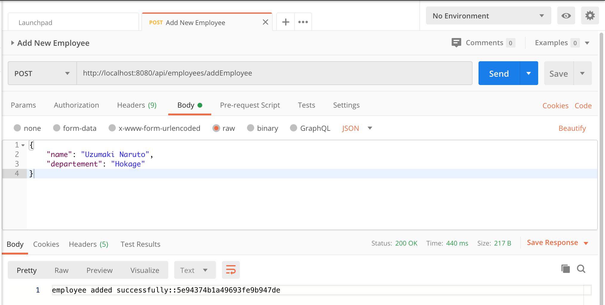
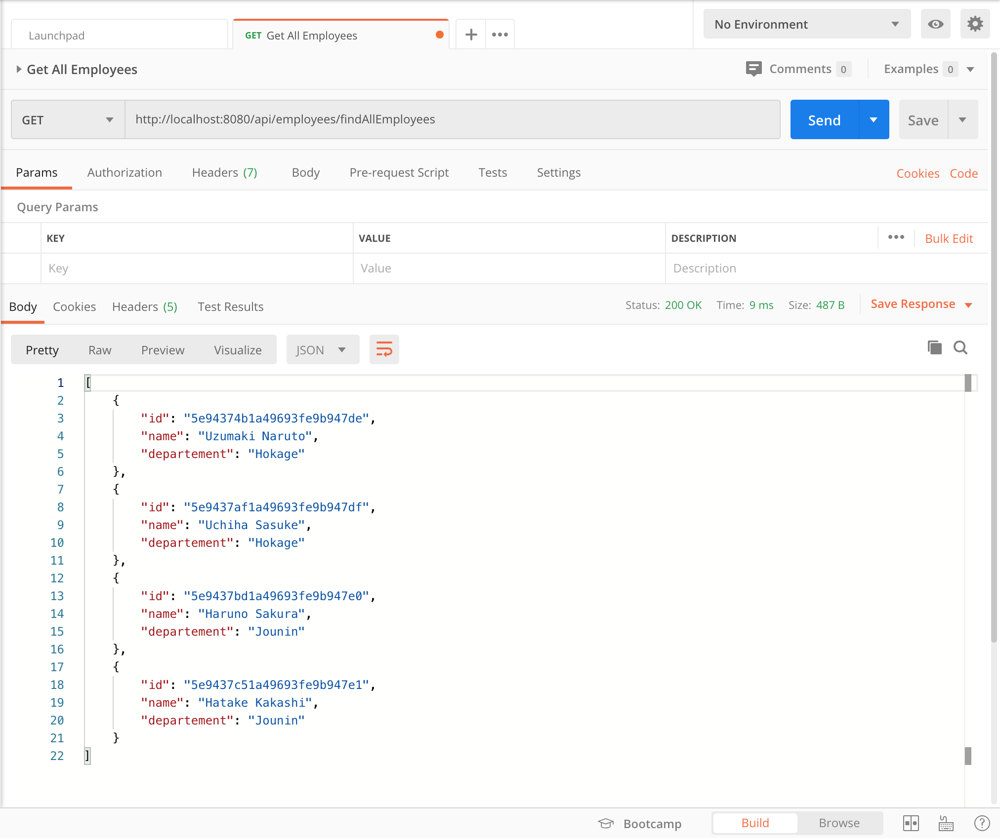
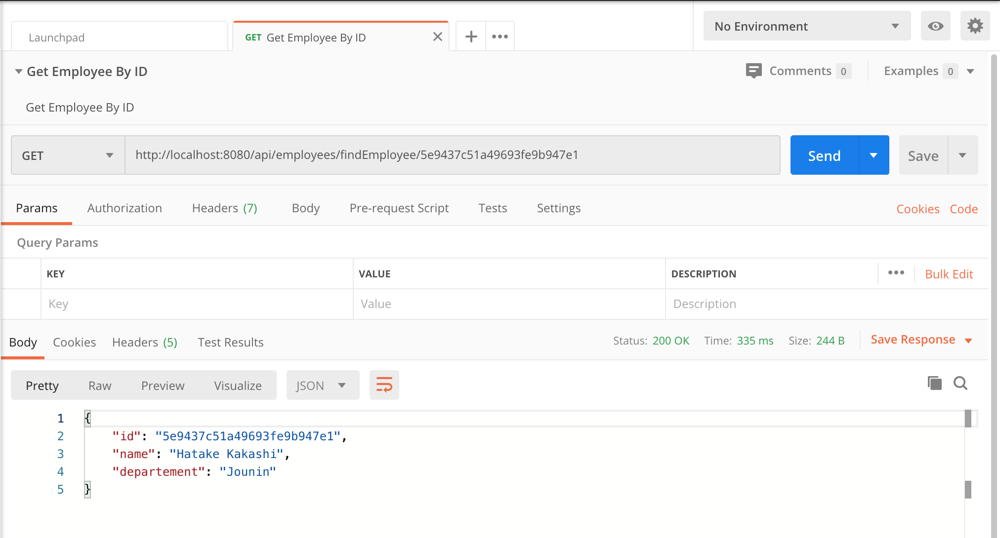
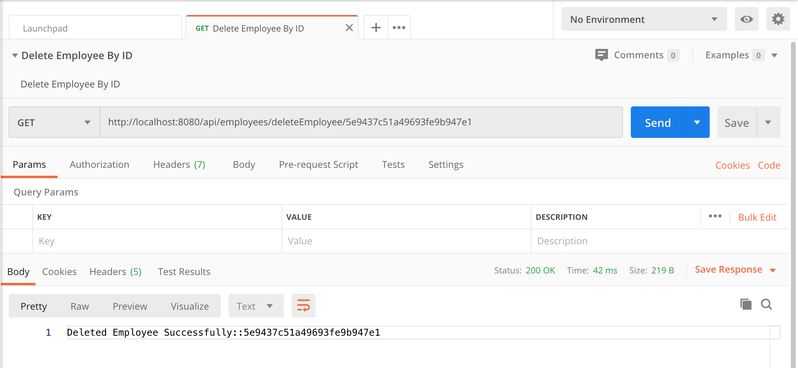

# springboot-mongodb-docker-compose

## Things to do list:
1. Clone this repository: `git clone https://github.com/hendisantika/springboot-mongodb-docker-compose.git`.
2. Go inside folder: `cd springboot-mongodb-docker-compose`.
3. Run application on local: `mvn clean spring-boot:run`.
4. Open POSTMAN app and follow the screen shot below:

## Screen shot

Add New Employee

List All Employees

Find Employee By Id

Delete Employee By Id

