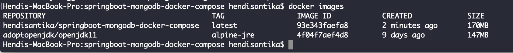

# springboot-mongodb-docker-compose

## Things to do list:
1. Clone this repository: `git clone https://github.com/hendisantika/springboot-mongodb-docker-compose.git`.
2. Go inside folder: `cd springboot-mongodb-docker-compose`.
3. Run application on local: `mvn clean spring-boot:run`.
4. Open POSTMAN app and follow the screen shot below:

## Screen shot

Add New Employee


List All Employees


Find Employee By Id


Delete Employee By Id


## Run with Docker

1. Package the application: `mvn clean package`.
2. Build Docker Image: `docker build -t hendisantika/springboot-mongodb-docker-compose .`
3. Check Docker Images is exist: `docker images`
4. Run Docker Compose: `docker-compose up`
```shell script
Creating network "springboot-mongodb-docker-compose_default" with the default driver
Pulling mymongodb (mongo:latest)...
latest: Pulling from library/mongo
5bed26d33875: Pull complete
f11b29a9c730: Pull complete
930bda195c84: Pull complete
78bf9a5ad49e: Pull complete
3d7fb3809884: Pull complete
a7237292ff8a: Pull complete
c936e28b5159: Pull complete
3fb56b127f30: Pull complete
c54a0478af29: Pull complete
ffc3a4dd1cdc: Pull complete
236ffdb10499: Pull complete
c33efe03b109: Pull complete
1d3609ce2ac9: Pull complete
Digest: sha256:1e33093260855e83baee0237e29947e243818c58a1d37b1022909e227f624d7a
Status: Downloaded newer image for mongo:latest
Creating mymongodb ... done
Creating springboot-mongodb-docker-compose ... done
Attaching to mymongodb, springboot-mongodb-docker-compose
mymongodb             | 2020-04-13T12:02:53.793+0000 I  CONTROL  [main] Automatically disabling TLS 1.0, to force-enable TLS 1.0 specify --sslDisabledProtocols 'none'
mymongodb             | 2020-04-13T12:02:53.802+0000 W  ASIO     [main] No TransportLayer configured during NetworkInterface startup
mymongodb             | 2020-04-13T12:02:53.804+0000 I  CONTROL  [initandlisten] MongoDB starting : pid=1 port=27017 dbpath=/data/db 64-bit host=2a214ce090d3
mymongodb             | 2020-04-13T12:02:53.804+0000 I  CONTROL  [initandlisten] db version v4.2.5
mymongodb             | 2020-04-13T12:02:53.804+0000 I  CONTROL  [initandlisten] git version: 2261279b51ea13df08ae708ff278f0679c59dc32
mymongodb             | 2020-04-13T12:02:53.804+0000 I  CONTROL  [initandlisten] OpenSSL version: OpenSSL 1.1.1  11 Sep 2018
mymongodb             | 2020-04-13T12:02:53.804+0000 I  CONTROL  [initandlisten] allocator: tcmalloc
mymongodb             | 2020-04-13T12:02:53.804+0000 I  CONTROL  [initandlisten] modules: none
mymongodb             | 2020-04-13T12:02:53.804+0000 I  CONTROL  [initandlisten] build environment:
mymongodb             | 2020-04-13T12:02:53.804+0000 I  CONTROL  [initandlisten]     distmod: ubuntu1804
mymongodb             | 2020-04-13T12:02:53.804+0000 I  CONTROL  [initandlisten]     distarch: x86_64
mymongodb             | 2020-04-13T12:02:53.804+0000 I  CONTROL  [initandlisten]     target_arch: x86_64
mymongodb             | 2020-04-13T12:02:53.804+0000 I  CONTROL  [initandlisten] options: { net: { bindIp: "*" } }
mymongodb             | 2020-04-13T12:02:53.808+0000 I  STORAGE  [initandlisten] 
mymongodb             | 2020-04-13T12:02:53.808+0000 I  STORAGE  [initandlisten] ** WARNING: Using the XFS filesystem is strongly recommended with the WiredTiger storage engine
mymongodb             | 2020-04-13T12:02:53.808+0000 I  STORAGE  [initandlisten] **          See http://dochub.mongodb.org/core/prodnotes-filesystem
mymongodb             | 2020-04-13T12:02:53.808+0000 I  STORAGE  [initandlisten] wiredtiger_open config: create,cache_size=482M,cache_overflow=(file_max=0M),session_max=33000,eviction=(threads_min=4,threads_max=4),config_base=false,statistics=(fast),log=(enabled=true,archive=true,path=journal,compressor=snappy),file_manager=(close_idle_time=100000,close_scan_interval=10,close_handle_minimum=250),statistics_log=(wait=0),verbose=[recovery_progress,checkpoint_progress],
mymongodb             | 2020-04-13T12:02:54.527+0000 I  STORAGE  [initandlisten] WiredTiger message [1586779374:527058][1:0x7fb766815b00], txn-recover: Set global recovery timestamp: (0, 0)
mymongodb             | 2020-04-13T12:02:54.540+0000 I  RECOVERY [initandlisten] WiredTiger recoveryTimestamp. Ts: Timestamp(0, 0)
mymongodb             | 2020-04-13T12:02:54.553+0000 I  STORAGE  [initandlisten] Timestamp monitor starting
mymongodb             | 2020-04-13T12:02:54.558+0000 I  CONTROL  [initandlisten] 
mymongodb             | 2020-04-13T12:02:54.558+0000 I  CONTROL  [initandlisten] ** WARNING: Access control is not enabled for the database.
mymongodb             | 2020-04-13T12:02:54.558+0000 I  CONTROL  [initandlisten] **          Read and write access to data and configuration is unrestricted.
mymongodb             | 2020-04-13T12:02:54.558+0000 I  CONTROL  [initandlisten] 
mymongodb             | 2020-04-13T12:02:54.560+0000 I  STORAGE  [initandlisten] createCollection: admin.system.version with provided UUID: 6882bbfe-fa22-4341-a1fb-b3f85d403bcf and options: { uuid: UUID("6882bbfe-fa22-4341-a1fb-b3f85d403bcf") }
mymongodb             | 2020-04-13T12:02:54.572+0000 I  INDEX    [initandlisten] index build: done building index _id_ on ns admin.system.version
mymongodb             | 2020-04-13T12:02:54.573+0000 I  SHARDING [initandlisten] Marking collection admin.system.version as collection version: <unsharded>
mymongodb             | 2020-04-13T12:02:54.573+0000 I  COMMAND  [initandlisten] setting featureCompatibilityVersion to 4.2
mymongodb             | 2020-04-13T12:02:54.573+0000 I  SHARDING [initandlisten] Marking collection local.system.replset as collection version: <unsharded>
mymongodb             | 2020-04-13T12:02:54.574+0000 I  STORAGE  [initandlisten] Flow Control is enabled on this deployment.
mymongodb             | 2020-04-13T12:02:54.574+0000 I  SHARDING [initandlisten] Marking collection admin.system.roles as collection version: <unsharded>
mymongodb             | 2020-04-13T12:02:54.575+0000 I  STORAGE  [initandlisten] createCollection: local.startup_log with generated UUID: 5506b931-69e1-477d-aee2-91ef54097fb1 and options: { capped: true, size: 10485760 }
mymongodb             | 2020-04-13T12:02:54.588+0000 I  INDEX    [initandlisten] index build: done building index _id_ on ns local.startup_log
mymongodb             | 2020-04-13T12:02:54.589+0000 I  SHARDING [initandlisten] Marking collection local.startup_log as collection version: <unsharded>
mymongodb             | 2020-04-13T12:02:54.592+0000 I  FTDC     [initandlisten] Initializing full-time diagnostic data capture with directory '/data/db/diagnostic.data'
mymongodb             | 2020-04-13T12:02:54.594+0000 I  SHARDING [LogicalSessionCacheRefresh] Marking collection config.system.sessions as collection version: <unsharded>
mymongodb             | 2020-04-13T12:02:54.595+0000 I  NETWORK  [listener] Listening on /tmp/mongodb-27017.sock
mymongodb             | 2020-04-13T12:02:54.595+0000 I  NETWORK  [listener] Listening on 0.0.0.0
mymongodb             | 2020-04-13T12:02:54.596+0000 I  STORAGE  [LogicalSessionCacheRefresh] createCollection: config.system.sessions with provided UUID: f6e3979d-dec1-4e61-8f12-ab38b0250c8c and options: { uuid: UUID("f6e3979d-dec1-4e61-8f12-ab38b0250c8c") }
mymongodb             | 2020-04-13T12:02:54.596+0000 I  CONTROL  [LogicalSessionCacheReap] Sessions collection is not set up; waiting until next sessions reap interval: config.system.sessions does not exist
mymongodb             | 2020-04-13T12:02:54.595+0000 I  NETWORK  [listener] waiting for connections on port 27017
mymongodb             | 2020-04-13T12:02:54.613+0000 I  INDEX    [LogicalSessionCacheRefresh] index build: done building index _id_ on ns config.system.sessions
mymongodb             | 2020-04-13T12:02:54.630+0000 I  INDEX    [LogicalSessionCacheRefresh] index build: starting on config.system.sessions properties: { v: 2, key: { lastUse: 1 }, name: "lsidTTLIndex", ns: "config.system.sessions", expireAfterSeconds: 1800 } using method: Hybrid
mymongodb             | 2020-04-13T12:02:54.630+0000 I  INDEX    [LogicalSessionCacheRefresh] build may temporarily use up to 200 megabytes of RAM
mymongodb             | 2020-04-13T12:02:54.630+0000 I  INDEX    [LogicalSessionCacheRefresh] index build: collection scan done. scanned 0 total records in 0 seconds
mymongodb             | 2020-04-13T12:02:54.631+0000 I  INDEX    [LogicalSessionCacheRefresh] index build: inserted 0 keys from external sorter into index in 0 seconds
mymongodb             | 2020-04-13T12:02:54.634+0000 I  INDEX    [LogicalSessionCacheRefresh] index build: done building index lsidTTLIndex on ns config.system.sessions
mymongodb             | 2020-04-13T12:02:55.000+0000 I  SHARDING [ftdc] Marking collection local.oplog.rs as collection version: <unsharded>
springboot-mongodb-docker-compose | 
springboot-mongodb-docker-compose |   .   ____          _            __ _ _
springboot-mongodb-docker-compose |  /\\ / ___'_ __ _ _(_)_ __  __ _ \ \ \ \
springboot-mongodb-docker-compose | ( ( )\___ | '_ | '_| | '_ \/ _` | \ \ \ \
springboot-mongodb-docker-compose |  \\/  ___)| |_)| | | | | || (_| |  ) ) ) )
springboot-mongodb-docker-compose |   '  |____| .__|_| |_|_| |_\__, | / / / /
springboot-mongodb-docker-compose |  =========|_|==============|___/=/_/_/_/
springboot-mongodb-docker-compose |  :: Spring Boot ::        (v2.2.6.RELEASE)
springboot-mongodb-docker-compose | 
springboot-mongodb-docker-compose | 2020-04-13 12:02:56.536  INFO 1 --- [           main] pringbootMongodbDockerComposeApplication : Starting SpringbootMongodbDockerComposeApplication v0.0.1-SNAPSHOT on 3df98b0cb4ed with PID 1 (/app.jar started by root in /)
springboot-mongodb-docker-compose | 2020-04-13 12:02:56.543  INFO 1 --- [           main] pringbootMongodbDockerComposeApplication : The following profiles are active: docker
springboot-mongodb-docker-compose | 2020-04-13 12:02:57.438  INFO 1 --- [           main] .s.d.r.c.RepositoryConfigurationDelegate : Bootstrapping Spring Data MongoDB repositories in DEFAULT mode.
springboot-mongodb-docker-compose | 2020-04-13 12:02:57.526  INFO 1 --- [           main] .s.d.r.c.RepositoryConfigurationDelegate : Finished Spring Data repository scanning in 79ms. Found 1 MongoDB repository interfaces.
springboot-mongodb-docker-compose | 2020-04-13 12:02:58.452  INFO 1 --- [           main] o.s.b.w.embedded.tomcat.TomcatWebServer  : Tomcat initialized with port(s): 8080 (http)
springboot-mongodb-docker-compose | 2020-04-13 12:02:58.471  INFO 1 --- [           main] o.apache.catalina.core.StandardService   : Starting service [Tomcat]
springboot-mongodb-docker-compose | 2020-04-13 12:02:58.472  INFO 1 --- [           main] org.apache.catalina.core.StandardEngine  : Starting Servlet engine: [Apache Tomcat/9.0.33]
springboot-mongodb-docker-compose | 2020-04-13 12:02:58.567  INFO 1 --- [           main] o.a.c.c.C.[Tomcat].[localhost].[/]       : Initializing Spring embedded WebApplicationContext
springboot-mongodb-docker-compose | 2020-04-13 12:02:58.567  INFO 1 --- [           main] o.s.web.context.ContextLoader            : Root WebApplicationContext: initialization completed in 1916 ms
springboot-mongodb-docker-compose | 2020-04-13 12:02:59.003  INFO 1 --- [           main] org.mongodb.driver.cluster               : Cluster created with settings {hosts=[mymongodb:27017], mode=MULTIPLE, requiredClusterType=UNKNOWN, serverSelectionTimeout='30000 ms', maxWaitQueueSize=500}
springboot-mongodb-docker-compose | 2020-04-13 12:02:59.003  INFO 1 --- [           main] org.mongodb.driver.cluster               : Adding discovered server mymongodb:27017 to client view of cluster
mymongodb             | 2020-04-13T12:02:59.084+0000 I  NETWORK  [listener] connection accepted from 172.19.0.3:59694 #1 (1 connection now open)
mymongodb             | 2020-04-13T12:02:59.106+0000 I  NETWORK  [conn1] received client metadata from 172.19.0.3:59694 conn1: { driver: { name: "mongo-java-driver|legacy", version: "3.11.2" }, os: { type: "Linux", name: "Linux", architecture: "amd64", version: "4.19.76-linuxkit" }, platform: "Java/AdoptOpenJDK/11.0.6+10" }
springboot-mongodb-docker-compose | 2020-04-13 12:02:59.156  INFO 1 --- [mymongodb:27017] org.mongodb.driver.connection            : Opened connection [connectionId{localValue:1, serverValue:1}] to mymongodb:27017
springboot-mongodb-docker-compose | 2020-04-13 12:02:59.171  INFO 1 --- [mymongodb:27017] org.mongodb.driver.cluster               : Monitor thread successfully connected to server with description ServerDescription{address=mymongodb:27017, type=STANDALONE, state=CONNECTED, ok=true, version=ServerVersion{versionList=[4, 2, 5]}, minWireVersion=0, maxWireVersion=8, maxDocumentSize=16777216, logicalSessionTimeoutMinutes=30, roundTripTimeNanos=5802900}
springboot-mongodb-docker-compose | 2020-04-13 12:02:59.173  INFO 1 --- [mymongodb:27017] org.mongodb.driver.cluster               : Discovered cluster type of STANDALONE
springboot-mongodb-docker-compose | 2020-04-13 12:02:59.743  INFO 1 --- [           main] o.s.s.concurrent.ThreadPoolTaskExecutor  : Initializing ExecutorService 'applicationTaskExecutor'
springboot-mongodb-docker-compose | 2020-04-13 12:03:00.012  INFO 1 --- [           main] o.s.b.w.embedded.tomcat.TomcatWebServer  : Tomcat started on port(s): 8080 (http) with context path ''
springboot-mongodb-docker-compose | 2020-04-13 12:03:00.016  INFO 1 --- [           main] pringbootMongodbDockerComposeApplication : Started SpringbootMongodbDockerComposeApplication in 4.508 seconds (JVM running for 5.511)
mymongodb             | 2020-04-13T12:07:54.594+0000 I  SHARDING [LogicalSessionCacheReap] Marking collection config.transactions as collection version: <unsharded>


```

Docker Build


Docker Images



Docker Compose UP

